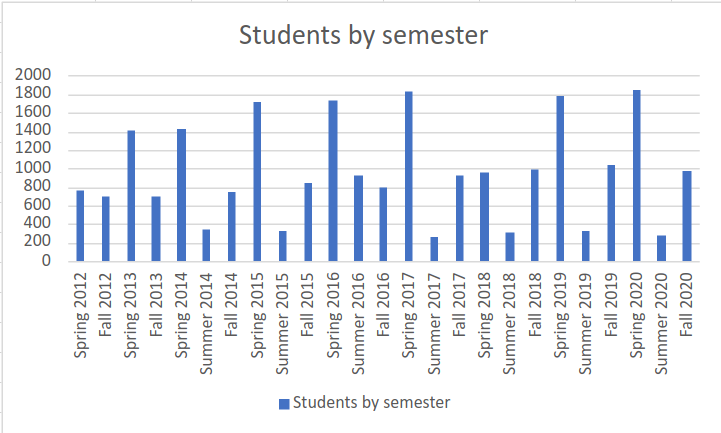

# Graduation Scraper

## About

NDSU Releases a list every fall and spring semester (and sometimes summer) of the students who have graduated for that semester. This program collects that information into one sqlite table for easier querying, from 2012 to 2020. Accuracy isn't assured to do release consent (maybe) and also my trash code.

## fun stats

### All stats are for the 2012-2020 time period 

- About 96% of NDSU graduates are from America.
- The next closest country is China, with 0.007% of graduates
- The top three states that graduates originate from are North Dakota (10719) Minnesota (10574) and South Dakota (436)
- 38.25% of students graduate with honors (above a 3.5 gpa)
- The highest ratio of students graduating honors vs not for majors with more than 100 people who have graduated in them are Exercise Science (58.8%) Nursing (55.3%) and Dietics (53.8%)
- The lowest ratios are pharmacy (0.4%), Plant Sciences (0.8%) and University Studies (11%) {Honestly this doesn't seem right}
- 24% of CSCI students graduate with honors. 
- The most common major is nursing with 1392 majors, followed by mechanical engineering with 1056 majors and Psychology with 771 majors. 
- Computer science accounts for 640 majors
- The most common degree is a BS (13721) followed by MS (1414), BSN (1378), BSME (1019) then PHD(720). There are multiple degrees/certifications that only a handful of people have ever recieved, including BSCENG(2), MAMCM(1), CERT1(5). In total NDSU has handed out 51 different degrees.

### Graduation counts by semester

